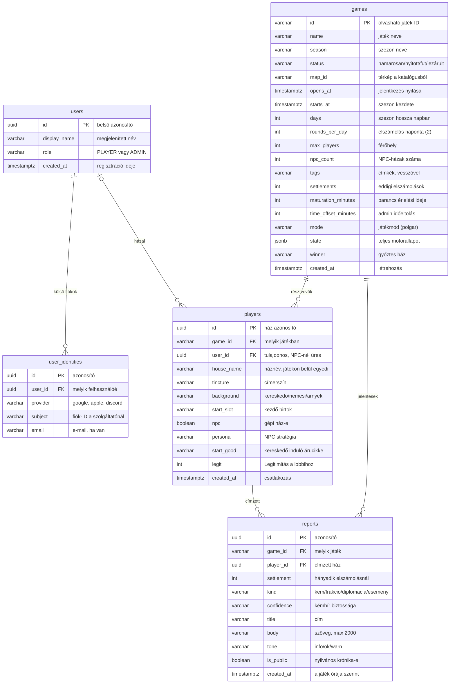
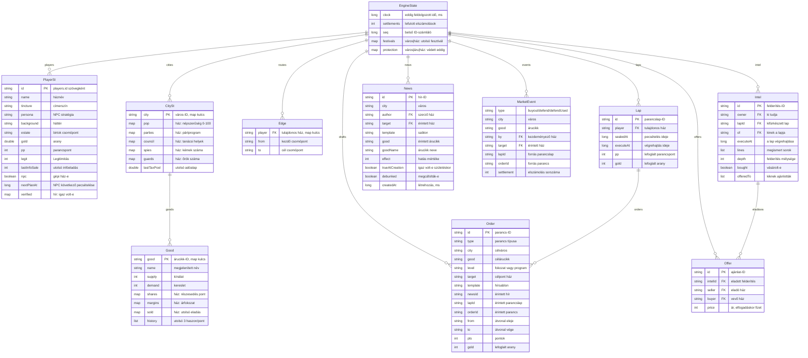

# Adatbázis-séma

A Trón nélkül backend (`tron-nelkul/backend`) PostgreSQL-sémája a Flyway V1 + V2 migrációk után, és a `games.state` JSONB oszlop belső szerkezete (`engine/EngineState.java`).

- [`tron_nelkul.dbml`](tron_nelkul.dbml): szerkeszthető ERD mezőszintű megjegyzésekkel. Nyisd meg a [dbdiagram.io](https://dbdiagram.io)-n (új diagram, a fájl tartalmát illeszd be), ott a táblák húzhatók és az ábra PNG/PDF/SQL formátumban exportálható.
- Az alábbi Mermaid-ábrák a GitHubon és a VS Code Markdown-előnézetében jelennek meg, és a [mermaid.live](https://mermaid.live) oldalon is szerkeszthetők.

## Relációs táblák

## A `games.state` JSONB (EngineState)

Ezek nem valódi táblák: a kapcsolatok szöveges azonosítók, az adatbázis nem ellenőrzi őket.

